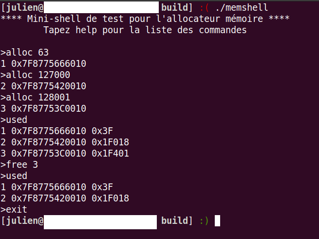

[![LinkedIn][linkedin-shield]][linkedin-url]
 

Memory allocator in C (malloc)
==================

All files are covered by the GPLv3+ license

## Introduction

Implementation of a dynamic memory allocator similar to `malloc` under Linux (GNU libc) in C language.

Attached pdf topic or [here](https://systemes.pages.ensimag.fr/sepc/TP/S1/) (French version).

## How to use it
### To install: 
Clone the project to your device and run these commands:

> `cd build` 

> `cmake ..`

> `cmake ..` // to move cmake files to build

> `make`

> `make test`

(<a href="#readme-top">back to top</a>)

### Available commands:
These commands are to be typed in the `build` directory.

To see the results of the different tests:
> `make check`

For a summary of the tests:
> `make test`

Interactive shell to test allocations, can run gdb to debug
> `./memshell`

(<a href="#readme-top">back to top</a>)

How to use memshell
----------

Available commands :
1) **init** : initialize or reset the allocator
2) **alloc** <size> : allocation of a memory block.
	The size can be in decimal or hexadecimal (prefix 0x)
	return : block identifier and starting address of the area
3) **free** <identifier> : release a block
4) **destroy** : release of the allocator
5) **show** : display the initial size and the starting address
6) **used** : display the list of occupied blocks
	in the form {identifier, starting address, size}
6) **help** : display this manual
7) **exit** : quit the shell

Remarks:
1) At launch, the shell calls mem_init
2) The shell supports up to 5000 allocations between two initializations

(<a href="#readme-top">back to top</a>)

Description of the implementation
----------
Handles allocations for 3 different sizes (small, medium, large).

Small sizes are managed with a simply chained list (*pool*) of available *chunks* of the same size. When there is no more *chunk* available, a request is made to the system, with a recursive doubling mechanism to amortize the cost.

Use of the *Buddy* agorithm to manage average sizes

Test sets and skeleton provided (Google Test)

[linkedin-shield]: https://img.shields.io/badge/-LinkedIn-black.svg?style=for-the-badge&logo=linkedin&colorB=555
[linkedin-url]: https://www.linkedin.com/in/julien-bourseau-ba2239228

<!-- CONTACT -->
## Contact

Bourseau Julien - *1st year student at Ensimag* - julien.bourseau@gmail.com

Project Link: [https://github.com/julienbrs/Find-closest-pair-of-points](https://github.com/julienbrs/Find-closest-pair-of-points)

(<a href="#readme-top">back to top</a>)

